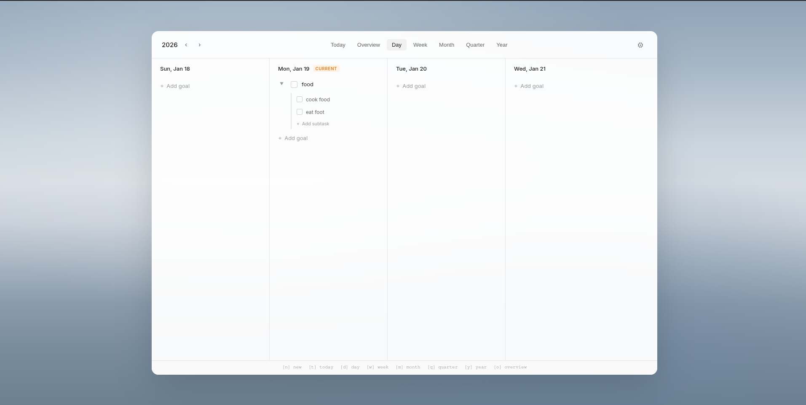
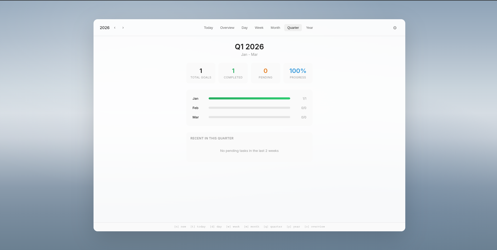

# Epoch Goals

A minimalist goal tracking dashboard. Stay focused on what matters across different time horizons.

**Available as:** Chrome Extension • Linux Desktop App

## Screenshots

### Day View


### Quarter View


## Features

- 📅 **Multiple Views** - Track goals by day, week, month, quarter, or year
- ✅ **Subtasks** - Break down goals into manageable subtasks
- ⌨️ **Keyboard Navigation** - Full keyboard support for power users
- 🔄 **Recurring Tasks** - Set up daily, weekly, or monthly recurring goals
- 🎯 **Drag & Drop** - Reorder and reschedule tasks easily
- 💾 **Local Storage** - All data stays on your device

## Installation

### 🐧 Linux Desktop App (Native)

The native app is built with Tauri for fast performance and small size (~3 MB).

#### Debian / Ubuntu
```bash
# Download the .deb from releases, then:
sudo dpkg -i epoch-goals_1.0.0_amd64.deb
```

#### Fedora / RHEL / CentOS
```bash
# Download the .rpm from releases, then:
sudo rpm -i epoch-goals-1.0.0-1.x86_64.rpm
```

#### Arch Linux (AUR)
```bash
# Using yay
yay -S epoch-goals-bin

# Using paru
paru -S epoch-goals-bin

# Manual install
git clone https://aur.archlinux.org/epoch-goals-bin.git
cd epoch-goals-bin
makepkg -si
```

#### AppImage (Universal)
```bash
# Download the .AppImage from releases, then:
chmod +x Epoch_Goals_1.0.0_amd64.AppImage
./Epoch_Goals_1.0.0_amd64.AppImage
```

#### From Source
```bash
git clone https://github.com/akhilesh-w/epoch-goals.git
cd epoch-goals
npm install
npm run tauri build
# Binary will be at: src-tauri/target/release/epoch-goals
```

---

### 🌐 Chrome Extension

1. **Download the extension**
   ```bash
   git clone https://github.com/akhilesh-w/epoch-goals.git
   ```
   Or download as ZIP: Click the green **Code** button → **Download ZIP** → Extract

2. **Load in Chrome**
   - Open Chrome and go to `chrome://extensions/`
   - Enable **Developer mode** (toggle in top right)
   - Click **Load unpacked**
   - Select the `epoch-goals` folder

3. **Done!** Open a new tab to see Epoch Goals

## Keyboard Shortcuts

| Key | Action |
|-----|--------|
| `↑` `↓` | Navigate between tasks |
| `←` `→` | Move between columns |
| `Enter` | Expand/collapse task |
| `Space` | Toggle completion |
| `e` | Edit task |
| `x` | Delete task |
| `Escape` | Close modal/cancel |

## Usage

- **Add a goal**: Click "+ Add goal" or navigate to it and press Enter
- **Add subtasks**: Click the expand arrow (▶) then "+ Add subtask"
- **Complete tasks**: Click the checkbox or press Space
- **Edit tasks**: Double-click or press `e`
- **Navigate time**: Use the `‹` `›` arrows next to the year

## Data Storage

All your goals are stored locally using `localStorage`. Your data never leaves your device.

**Migrating data** between Chrome extension and desktop app: Use Settings → Export/Import.

## License

MIT
